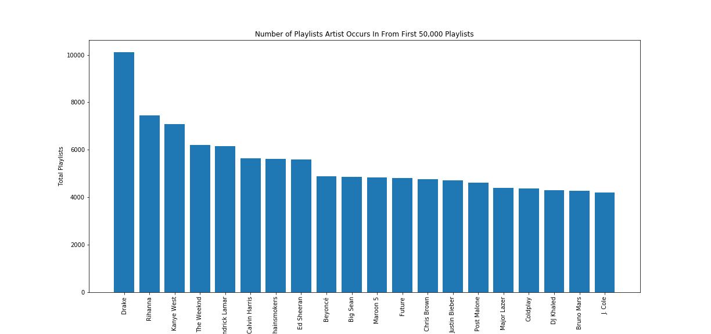
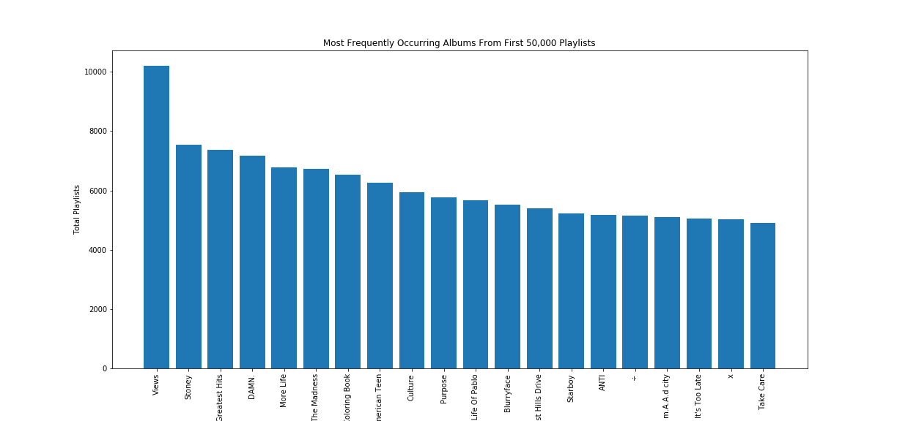
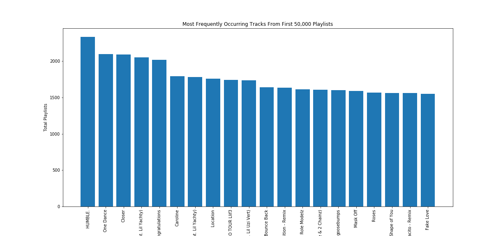
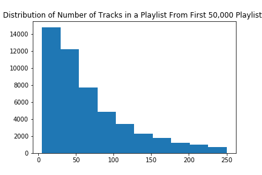
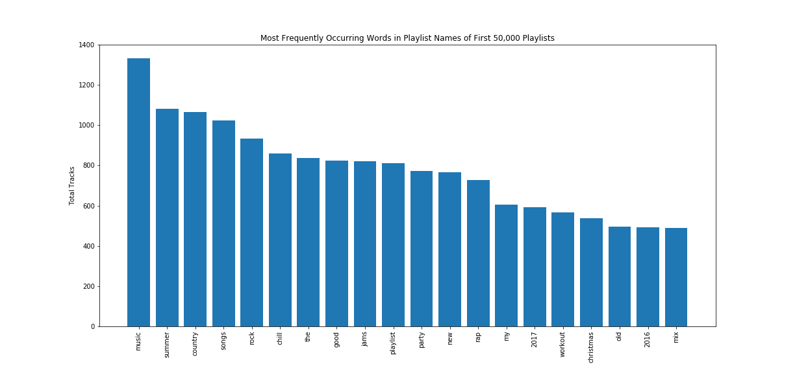
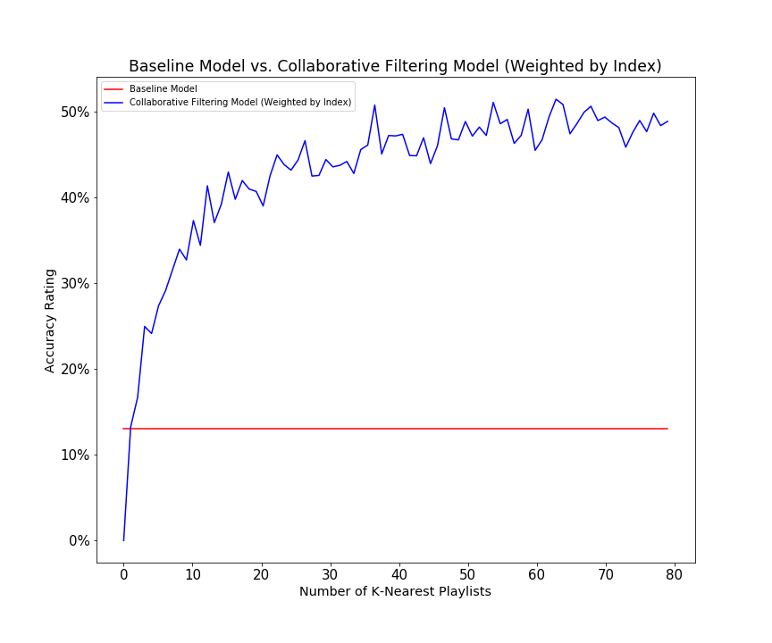
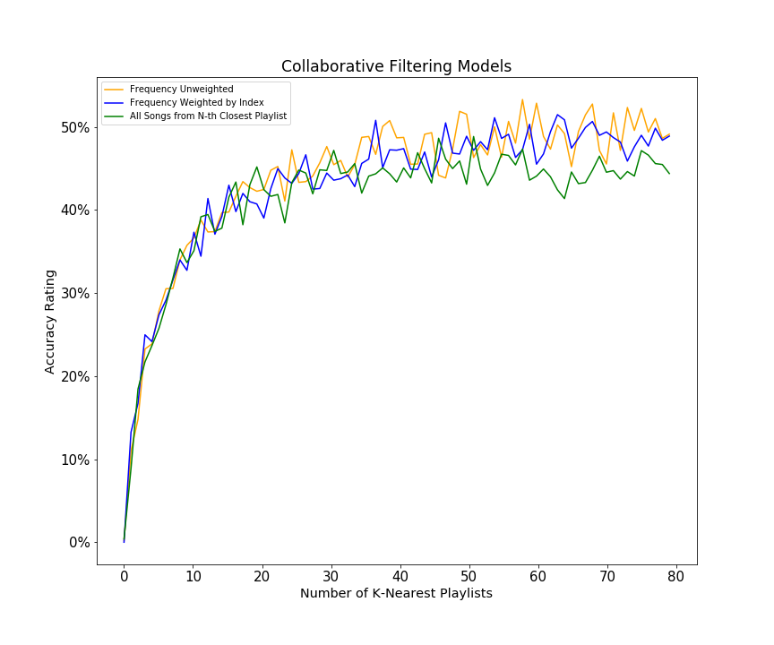

# Projet Overview:
---
* **[Introduction](#introduction)**
	* [Overview](#overview)
	* [Motivation](#motivation)
	* [Specification](#specification)
* **[EDA](#eda)**
	* [Data Description](#data-description)
	* [Visualizations](#visualizations)
* **[Models](#models)**
	* [Baseline Model](#base-line-model-recommending-tracks-by-popularity)
	* [Collaborative Filtering](#collaborative-filtering)
	* [Optimizations](#optimizations)
* **[Results](#results)**
	* [Recomendation Generator](#recommendation-overview)
	* [Accuracy Rating Graphs](#accuracy-ratings)
* **[Conclusions & Summary](#conclusions-&-summary)**
* **[Future Work](#future-work)**
* **[Team](#team)**

## Introduction

### Overview
Our project objective was to develop a reliable Music Recommendation System using information obtained from the Milion Playlist Dataset (MPD) and the Spotify API. Such a system should be able to take in a set of songs (i.e. a playlist of Spotify tracks), and then use algorithms to recommend songs that are the most similar to the original set. Thus, given a playlist of Spotify tracks, our model should be able to recommend a list of tracks that would constitue an appropriate extension of the playlist. In order to determine what constitutes an "appropriate" extension of songs, our models  copmare playlist features across the MPD, allowing us to gain insight into the way playlists are composed. By using a collaborative filtering algorithm, we were able to improve upon our baseline model of only recommending the most popular songs to any given playlist. Our algorithm utilizes a sparse matrix to determine the relative similarites between playlists, and then recommends songs from the most similar playlists. We also optimized our algorithm to weight tracks' occurences in more similar playlists as larger than the weight of tracks' occurences in less similar playlists. Our final results demonstrate that given half of a playlist's songs (with the other half obscured), our recommendation model will be able to predict approximately 50% of the obscured songs in its recommendation set. 

### Motivation 
Over the past decade, music streaming services have become increasingly popular, changing the way consumers interact with their audio content. Listeners are no longer bound to predetermined track listings on an album or record; rather, they are free to construct their own playlists as they see fit. As a result, the task of automatic playlist generation has become increasingly relevant to the streaming community. These services rely on intelligent systems in order enhance the playlist creation experience, analyzing user preferences and tastes to recommend new songs. Our project seeks to test the power of these recommendation models – observing which techniques perform best in the playlist continuation task. 

### Specification
Follow the below instructions to replicate our results.

#### Setup & Installation

After cloning our repo, ensure that you have python=3.6.* installed.

Install the requirements with `pip3 install requirements.txt`

Next, [download](https://drive.google.com/file/d/1vvKVox1_MNezGJA7PCt_ZplQDqoVYA--/view) Spotify's Million Playlist Dataset (MPD). Unzip the file and place it in the project's root directory.

#### Usage

To process the data from the MPD set, run `python3 main.py --parseData=x` where `x` is number of files to read (each file corresponds to 1000 playlists). We reccomend loading 100 files for local usage. This gives our classifier enough playlists to be meaningfully trained within a reasonable amount of time. 

After you have read the data from the MPD set you can simply run `python3 main.py` to run our classifier`

## EDA

### Data Description
Our project uses the Spotify Million PLaylist Dataset (MPD). The file structure consists of 10,000 `.json` subfiles, with each subfile containing 1,000 playlists. Each playlist object contains the following attributes: 

* __'collaborative': boolean__ (describes whether or not it is a collaborative playlist)
* __'duration_ms': int__ (the duration of the entire playlist in milliseconds)
* __'modified_at': int__ (the Unix Epoch Time value of when the playlist was last modified)
* __'name': str__ (name of the playlist)
* __'num_albums': int__ (number of unique albums in the playlist)
* __'num_artists': int__ (number of unique artists in the playlist)
* __'num_edits': int__ (number of times the playlist has been edited)
* __'num_followers': int__ (number of users that follow the playlist)
* __'num_tracks': int__ (number of tracks on the playlist)
* __'pid': int__ (the playlist ID number, ranging from 0 - 999,999,999)
* __'tracks': list of track objects__ (contains a list of tracks, where each track is an object containing
the following attributes:
	* {__'album_name': str__ (the name of the track’s album)
	* __'album_uri': str__ (the unique album ID -- uniform resource identifier)
	* __'artist_name': str__ (the name of the artist)
	* __'artist_uri': str__ (the unique artist ID -- uniform resource identifier)
	* __'duration_ms': int__ (the duration of the track in milliseconds)
	* __'pos': int__ (the track’s position in the playlist)
	* __'track_name'__ : str (the name of the track)})

### Visualizations
Because the majority of the data in the MPD is discrete, our initial data exploration involved finding frequencies of certain attributes in the playlist objects. For our visualizations, we considered the first 50,000 playlists (playlist id: [0-49,999]). 

#### Most Frequently Occuring Artists by Playlist

Our first visualizations displays the most popular artists according to their unique playlist appearances. As seen above, the most popular pop artists (Drake, Rihanna, and Kanye West) appear in a very large subset of playlists. 

#### Most Frequently Occuring Artists by Total Tracks

Our next visualization again displays the most popular artists, but this time according to how many total track appearances they have in the MPD. As seen above, Drake has over twice as many tracks as any other artist in the data set. These observations were important to leading us to our baseline popularity recommendation model, as we will see later in the project.

#### Most Frequently Occuring Albums

This visualization confirmed our artist popularity rankings -- the most popular pop artists dominated the most frequent albums in the data set (Drake, Post Malone, and Kendrick Lamar). 

#### Most Frequently Occuring Tracks

Finally, we observed the most frequently occuring tracks among unique playlists in the MPD. Once again, popular pop artist tracks consistently had the most appearances over unique playlists. As a result, we decided that our baseline model could simply recommend the most popular tracks in order of their frequency, as such song recommendations would have a higher probability of accuracy than if we chose songs at random. Statistically speaking, there is a high probability that a test-playlist contains popular pop songs; as a result, our accuracy score will improve upon random recommendations if we instead recommend the most popular songs.

#### Distribution of Number of Tracks in a Playlist

We also wated to explore the average length of a playlist, in order to gain insight into the number of songs we should potentially be recommending. As seen above, most playlists are less than 100 songs. When testing our models later on, we realized that because we would be obscuring half the playlist when making recommendations, we should calculate the hit rate if we were to recommend roughly 10 times the amount of obscured songs. As a result, typically our models recommended 500 songs (10 x 50 obscured songs = 500). To calculate our accuracy, we would divide the total number of obscured "hits" among the 500 recommendations by the total number of obscured songs.  

#### Most Frequent Words in Playlist Titles

We also looked at the most frequently occuring words in playlist titles to determine if such metrics could be valuable in terms of ranking popularity. However, as seen above, with the exception of a few genres (rap, country), the majority of words in the titles are non-descriptive. As a result, we decided we needed to research other effective recommendation algorithms. 

## Literature Review & Related Work

### Related Work
After conducting careful research on the most promising recommendation algorithms, we decided to implement a collaborative filtering algorithm for our system. We used the following online resources in researching and designing our recommendation system:

[Collaborative filtering at Spotify](https://www.slideshare.net/erikbern/collaborative-filtering-at-spotify-16182818)

[Machine Learning & Discover Weekly](https://medium.com/s/story/spotifys-discover-weekly-how-machine-learning-finds-your-new-music-19a41ab76efe)

[Introduction to Recommender Systems](https://cambridgespark.com/practical-introduction-to-recommender-systems/)

### Literature Review

*Shakirova, Elena. "Collaborative filtering for music recommender system." Young Researchers in Electrical and Electronic Engineering (EIConRus), 2017 IEEE Conference of Russian. IEEE, 2017.*

*Song, Yading, Simon Dixon, and Marcus Pearce. "A survey of music recommendation systems and future perspectives." 9th International Symposium on Computer Music Modeling and Retrieval. Vol. 4. 2012.*

*Ungar, Lyle H., and Dean P. Foster. "Clustering methods for collaborative filtering." AAAI workshop on recommendation systems. Vol. 1. 1998.*

*Van den Oord, Aaron, Sander Dieleman, and Benjamin Schrauwen. "Deep content-based music recommendation." Advances in neural information processing systems. 2013.*

## Models

### Baseline Model: Recommending Tracks by Popularity
Our baseline model recommended songs to a given playlist based on their popularity over the entire MPD. To determine their overall popularity, we calculated the frequency of each track over all the playlists in the dataset. We then recommend songs for the playlist in order of their relative frequency. As expected, such a model was largely innacurate in its recommendations, except when it was recommending for popular pop song playlists,

### Collaborative Filtering
To improve our baseline model, we researched the most effective algorithms for playlist recommendation. Our findings demonstrated that the "collaborative filtering" algorithm was a very powerful recommendation tool. At its heart, the collaborative filtering algorithm organizes the data into similar subsets, and then makes recommendations for a given item based on the non-overlapping features of items in the same subset. Thus, in the context of playlist generation, collaborative filtering groups playlists according to their similarities (i.e. playlists with similar songs), and then recommends songs to a given playlist based off of the non-overlapping songs from playlists in the same subset. 

#### Sparse-Matrix
The first step in implementing the collaborative filtering algorithm was creating a data structure that would allow us to organize playlists into similar subsets. To do so, we created a sparse-matrix of playlists and tracks: for each playlist in the dataset, we create a row entry in our matrix, and for each track in the dataset, we created a column. For every playlist, we encoded a 1 in a column entry if the track is included in the playlist and a 0 if the track is not included. Thus, each playlist is represented as a vector over all tracks in the dataset, creating an n (number of playlists) x m (number of total tracks in the playlist) matrix. See below:

|            | Song 1 | Song 2 | Song 3 | Song 4 |
|------------|--------|--------|--------|--------|
| Playlist 1 | 0      | 1      | 0      | 1      |
| Playlist 2 | 1      | 1      | 0      | 1      |
| Playlist 3 | 0      | 0      | 1      | 1      |

#### Playlist Similarity Metrics
After creating this sparse-matrix, we then needed to calculate a given playlist's similarity to all other playlist entries in the matrix. To do so, We used the following distance metric, where A and B are represent two unique playlist vectors: 

Using this calculation, we obtained a metric for each playlist's similarity to all other playlists. Using these values, we can then group playlists into subsets based on their relative similarity. To do this, we implemented a K-Nearest Neighbors algorithm, which would identify the K playlists that have the smallest distance to a given playlist. This algorithm would return K playlists, which we could then pull tracks from to recommend non-overlapping songs. 

### Optimizations
Our next task was to consider how we were going to pick which of the non-overlapping songs to recommend from these K-nearest playlists. 

#### All Songs from N-th Nearest Playlist
Our first approach was to recommend all non-overlapping songs from the n-th closest playlist, stopping once we've reached our song recommendation limit. However, this method relies too heavily on the closest playlists, and does not account for the fact that even the closest playlist will have many songs that differ from our original playlist. 

#### Unweighted Frequency
Instead of choosing all songs from the nearest playlists, we decided to only recommend the most popular songs over a group of the K-nearest playlists. To calculate a song's popularity amongs the K-nearest playlists, we simply calculated its relative frequency in the subset (summing up all of its occurences in the K-nearest playlists). Songs were then recommended in order of their frequency totals. 

#### Weighted Frequency
We then realized that we could further optimize the algorithm by redefining our popularity metric. Instead of totaling a given track's frequency over the K-nearest playlists, we realized we could weight each occurence of a track in a K-nearest playlist according to playlist's relative distance to the given playlist, and then sum over all of these weighted occurences. At first, we calculated this weight to be *__1/i__*, where *__i__* is equal the playlist's ordered index among k-nearest playlists. We then realized that such a weighting may not be representative of relative distance, as the difference in similarity between playlist 4 and playlist 5 is not necessarily the same as the difference in similarity between playlist 5 and playlist 6. We then implemented weighting of tracks according to the playlists cosine similarity, but such a weighting yielded similar or worse results to weighting by index.

#### Number of K-Neighbors
Another important optimization was choosing the number of K neighbor playlists from which to pull tracks from. Our analysis indicated that as we increased K, we imrpoved our accuracy scores. Such a realization was important to constructing our model, because it demonstrated that we should not necessarily recommend all songs from the top playlist -- rather, its important that we recommend songs that occur in a large number of similar playlists. Recommending all songs from only the nearest playlsts will potentially recommend an obscure song that does not appear in other similar playlists. 

#### Exclusion of Test Playlist from Similarity Matrix
Another optimization we made consisted of making sure that our similarity matrix did not include the test playlist itself as a vector entry. Doing so would overexaggerate our accuracy ratings, as songs from the real playlist were recommended with high probability (the real playlist would always be the most similar playlist, and thus the actual songs from the playlist would receive the highest weights). 

#### Exclusion of Unobscured Songs
Our last important optimization was ensuring that we never recommended songs in the playlist that are not obscured (i.e. seed songs), as doing so would negatively impact the likelihood of recommending an obscured song.

## Results

### [Recommendation Generator](https://lukecivantos.github.io/SpotifyDemonstration/)
An example of our recommendation system can be viewed by following the above [link](https://lukecivantos.github.io/SpotifyDemonstration/). As seen from the recommended song list, our model certainly passes an initial sanity check -- given a seed playlist of country music, our model will recommend country songs. No matter what type of seed playlist is given, our recommendations always consist of an "appropriate" extension.

### Accuracy Ratings
As stated earlier, we calculated our accuracy ratings by dividing the number of obscured track "hits" in our recommendation set by the total number of obscured tracks. For example, if our model recommended a set of songs that contained 20 of the obscured tracks, and we obscured a total of 50 tracks from the original playlist, our accuracy rating for that test would be 20/50 = 40%. As stated earlier, we recommened a total of 500 songs for each playlist. Additionally, for each run-through, we sampled 200 playlists and took the mean of their accuracy ratings in determining the final accuracy rating output.  

#### Baseline vs. Best CF Model
Our best model outperforms our baseline model by a significant amount: recommending solely based on track popularity has an average accuracy rating of 13.03%, while our collaborative filtering model with weights by similarity index reaches a peak accuracy rating of over 50%. Additionally, as seen below, the accuracy rating increases as we increase the number K nearest playlists to consider. This makes intuitive sense -- by adding a greater number of similar playlists when calculating frequency ratings, tracks that appear both in the closest playlists but also in the 10th through 80th closest playlists are probably more likely to have been in the original test playlist. Thus, as we increase the number of K-Nearest Playlists, our accuracy rating tends to increase because our model becomes more informed.

#### Comparison of Collaborative Filtering Models

Additionally, we wanted to compare the accuracy ratings across our different collaborative filtering models. As seen below, if we weight each track occurence by the inverse of the relative similarity index of the playlist it occurs in, we outperform the model of taking all songs from the N-th nearest playlist. This demonstrates simply taking all tracks from the N-th most similar playlists is actually less accurate than observing the frequency of the tracks over a larger group of similar playlists. As stated earlier, this makes sense -- a random song in the most similar playlist may not actually be likely to appear in our test playlist; rather, its important that the song also appears in many of the next most similar playlists. Additionally, we see that by weighting tracks by the inverse of their playist similarity index, we generally outperform the model in which track frequencies are unweighted. This realization also makes intuitive sense -- we should not weight an occurence in the 80th most similar playlist to be the same as an occurence in the 1st most similar playlist. 

## Conclusions & Summary

The goal of our final project was to create a Music Recommendation System that could reasonably extend a given playlist of Spotify tracks. After careful analysis of the Million Playlist Dataset, we were able to come up with four different recommendation models. The baseline model, albeit extremely naive in nature, was able to recommend a track set with an approximately 13% accuracy rating. However, upon implementing more robust collaborative filtering models, we were able recommend track sets with over 50% accuracy. Moreover, the [example generator](https://lukecivantos.github.io/SpotifyDemonstration/) clearly demonstrates that our playlist recommendations are in line with the identity of the original playlist. With a 50% accuracy rating, we felt that our recommendation model satisfied our desired objective. However, given more time, our group felt we could have expanded our collaborative filtering model to include song x song matrix similarities, allowing for an even deeper analysis (on the track-level) about which songs are most similar to the test playlist. Such an algorithm would be implemented so that after observing the K-most similar playlists, instaed of weighting tracks by frequency, we would instead weight tracks by their similarity metric to tracks in the test set. Such an additon would perhaps shed even more light on the similarities across playlist compositions.

## Future Work
We believe that future work on the Spotify Recommendation System could entail the use of the Spotify and Genius APIs. Spotify allows developers to request audio features for tracks (i.e. bpm, liveliness, acousticness, energy, etc.), providing even more information on quantifiable track similarities. Additionally, there is certainly work to be done in terms of identifying similar playlist titles, but such an endeavor would require a deeper knowledge of NLP that we felt was mostly outside the scope of this project.

## Team

Luke Civantos -- [lukecivantos@college.harvard.edu](lukecivantos@college.harvard.edu)  
Patrick Connors -- [patrickconnors@college.harvard.edu](patrickconnors@college.harvard.edu)  
Will Smiles -- [wsmiles@college.harvard.edu](wsmiles@college.harvard.edu)

